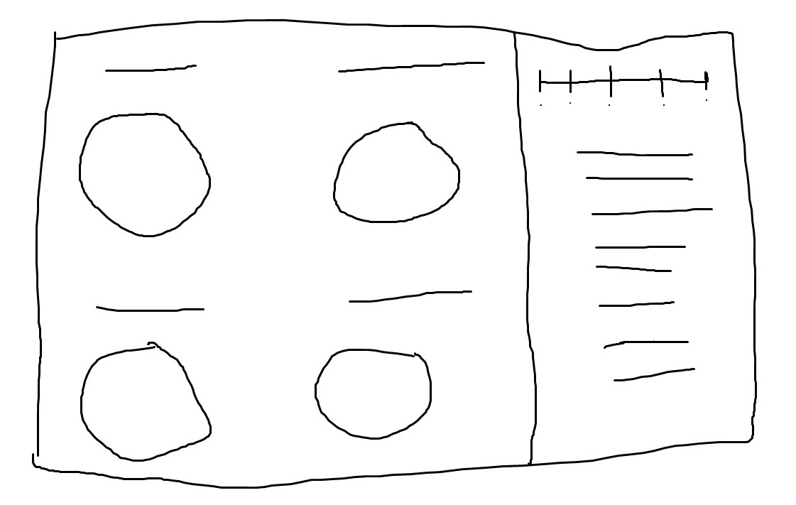
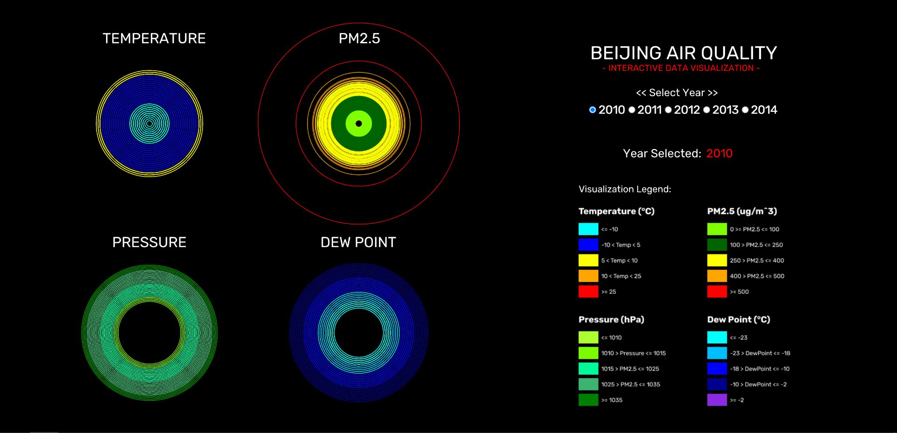

# ReadMe - HW05 Working Document

This week's assignment was to create a data visualization from one of the available datasets. I've selected the ***Beijing Air Quality*** dataset, specifically, the JSON version.

I chose this particular dataset as I found it to be quite interesting, and moreover, before diving into this project, I already had a vague idea as to how I would be presenting the data visually. I've depicted ***4 parameters:*** Temperature, PM2.5, Pressure, and Dew Point, and each "data wheel" consists of a ***1000 datapoints***.

Before proceeding with coding, I had created a rough digital sketch on Paint for how the dashboard would look like:



For the final result, in addition to my idea, I had taken some inspiration from Microsoft's Weather interface. I really like their UI, and how they display troves of data in different formats, and especially how they provide insights and at-a-glance information through pie-charts, or "circular graphs". (Well, they *used* to do that. They don't anymore after their UI overhall). Below is a screenshot of the actual interface that I've coded:



The one thing I changed between the initial sketch and the final render is how one navigates between the years. I had initially coded a slider to scroll through the year values, but later changed it to radio buttons as I felt that to be more intuitive and better, implementation-wise.

As the dataset contains *hourly* data for all the different parameters, my assignment depicts that "hourly quantity" in a pie-chart form. Each stroke represents an individual field value. In the visualization, I've calculated the *min.* and *max.* for all the fields, and have accordingly mapped the circle strokes to conform to that range:  
```
circleDim = map(dataPoint[i].TEMP, minTemp, maxTemp, 10, 400);
circleDim = map(dataPoint[i]["pm2.5"], minPM25, maxPM25, 10, 350);
circleDim = map(dataPoint[i].PRES, minPress, maxPress, 10, 265);
circleDim = map(dataPoint[i].DEWP, minDewp, maxDewp, 5, 420);
```  
Similarly, based on the minimum and maximum values, I've color-coded sub-ranges within a parameter's full gamut. (The visualization legend can be seen in the above screenshot)

With this, one can gather quantifiable insights regarding *temperature*, *PM2.5 concentration*, *pressue*, and *dew point* variations in Beijing over the course of 5 years (2010-2014).